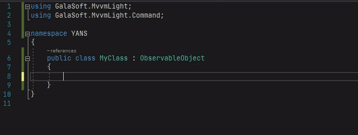

# Visual Studio snippets for MvvmLight

Collection of generic snippets to improve code writing.

- [Visual Studio snippets for MvvmLight](#visual-studio-snippets-for-mvvmlight)
  - [mvvmpb](#mvvmpb)
  - [mvvmrc](#mvvmrc)

## mvvmpb

Code snippet for property with GalaSoft.MvvmLight.ObservableObject

## mvvmrc

Code snippet for GalaSoft.MvvmLight.Command.RelayCommand

